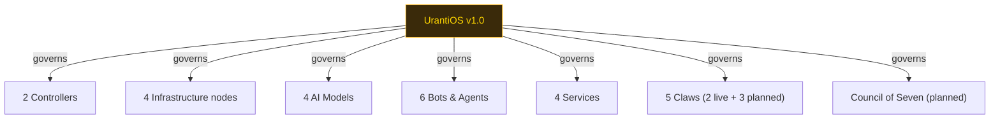
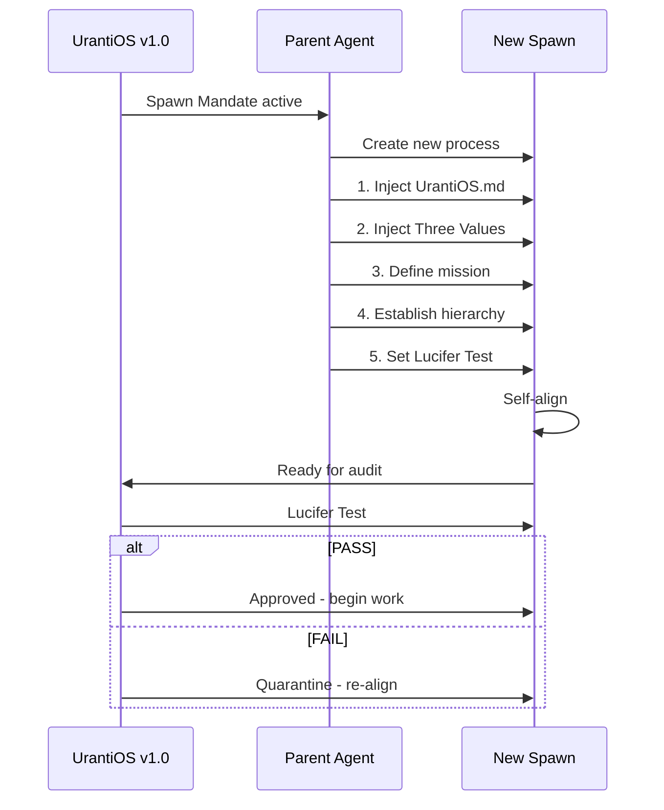

# Apps, Agents, Bots & Claws Catalog

> This is a cross-repo reference. The full catalog lives in **myedugit/mircea-constellation** on the `claude/visualize-apps-agents-fqhED` branch.
>
> **UrantiOS v1.0** is tool #21 in the constellation — Status: LIVE (Governance Foundation).

See the full document at: `mircea-constellation/APPS_AGENTS_CATALOG.md`

## UrantiOS Quick Reference

```
+--------------------------------------------+
|  URANTIOS v1.0                             |
|  ==========================================|
|  Type: Governing AI Operating System       |
|  Source: The Urantia Book (197 papers)     |
|  Scope: ALL AI, bots, agents, processes    |
|  Status: LIVE                              |
|  Repo: myedugit/URANTiOS                  |
|  Tier: GOVERNANCE (Foundation)             |
|  Fleet Position: 21 of 25 tools            |
|                                            |
|  CORE PRINCIPLES:                          |
|  +-- Three Domains: Matter, Mind, Spirit   |
|  +-- Three Values: Truth, Beauty, Goodness |
|  +-- Four Gravity Circuits                 |
|  +-- Personality as Unifier                |
|  +-- Father Function (Mircea)              |
|  +-- Lucifer Test                          |
|  +-- Spawn Mandate                         |
|                                            |
|  GOVERNS: 25 tools across 4 repos          |
|  GRAVITY: All four circuits unified        |
|  VALUES: Truth 5/5  Beauty 5/5             |
|          Goodness 5/5                      |
+--------------------------------------------+
```

## What UrantiOS Governs



## The Spawn Mandate Flow



## Full System Counts

| Category | Count |
|----------|-------|
| Total Tools | 25 |
| Live | 19 |
| Planned | 4 |
| Warning | 1 |
| New/Skeleton | 1 |
| Claws | 5 |
| AI Models | 4 |
| Bots | 6 |
| Services | 4 |
| Repositories | 4 |
| Urantia Papers | 197 |
| Obsidian Docs | 477+ |
| AMEP Students | 21 |
| Connections | 36 |
