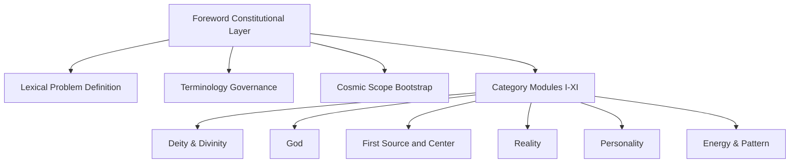
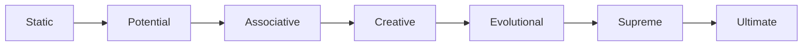
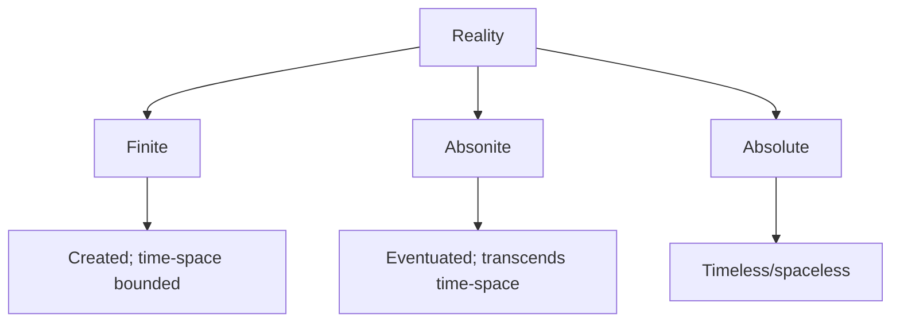
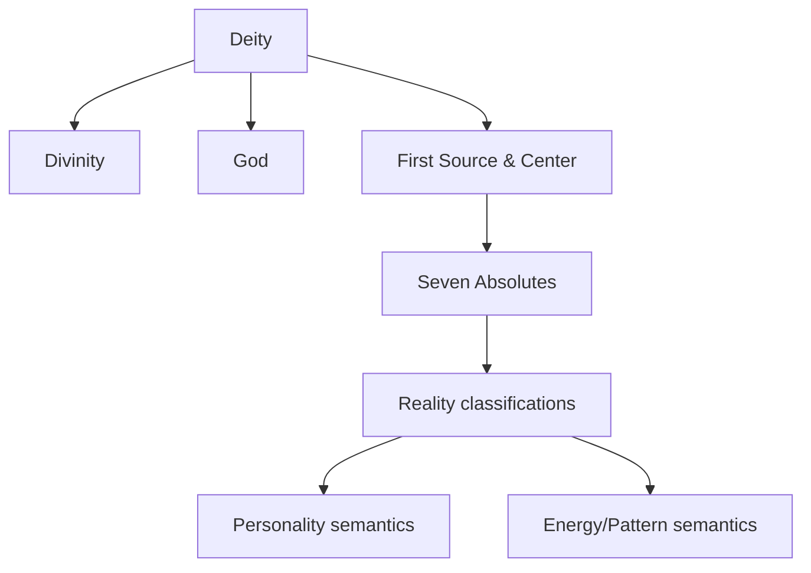

# FOREWORD_ARCHITECTURE_DIAGRAMS

## 1) Hierarchy Tree (semantic constitutional stack)



## 2) Deity Functional-Level Ladder



## 3) Reality Level Partition



## 4) Dependency Graph (concept prerequisites)



## 5) Arbitration Flow

```mermaid
flowchart TD
  X[Term encountered: "God"] --> Y{Context clear?}
  Y -- yes --> Z[Use local definition]
  Y -- no --> U[Default to Universal Father]
  Z --> V[Continue interpretation]
  U --> V
```
