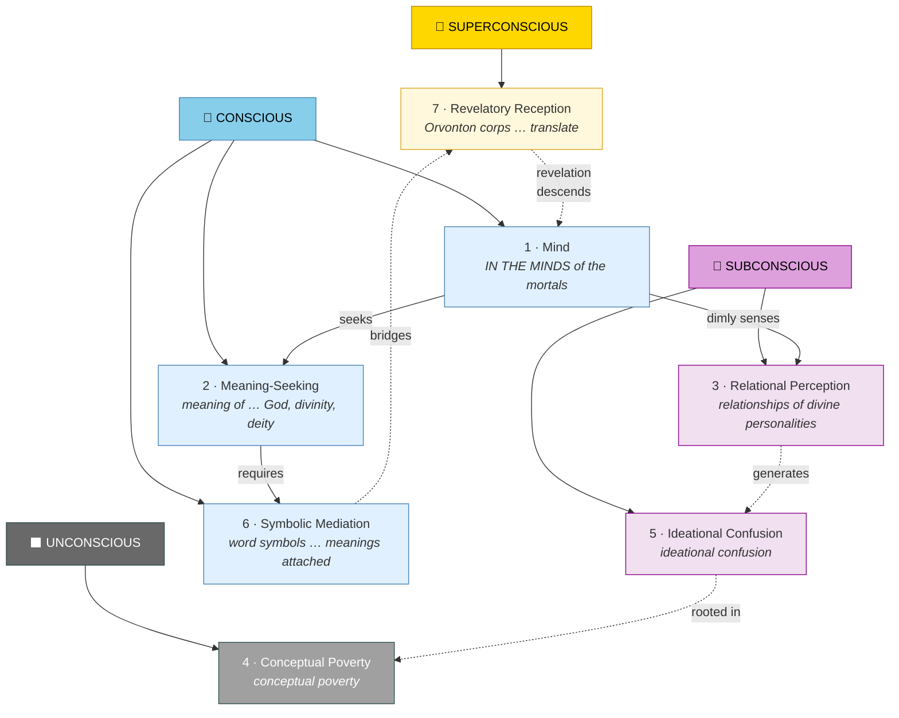
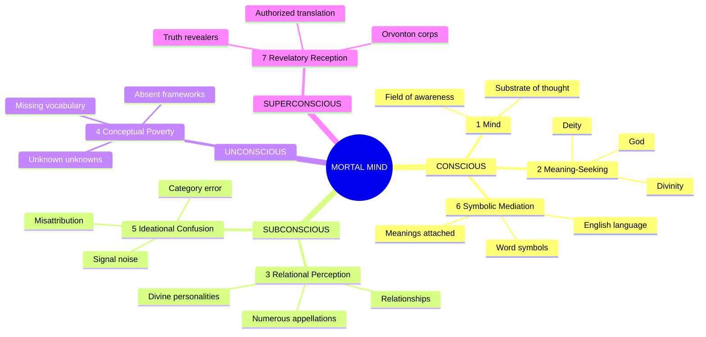
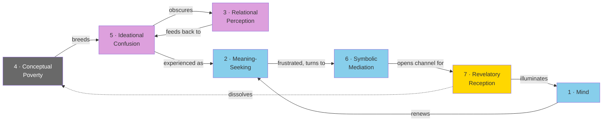
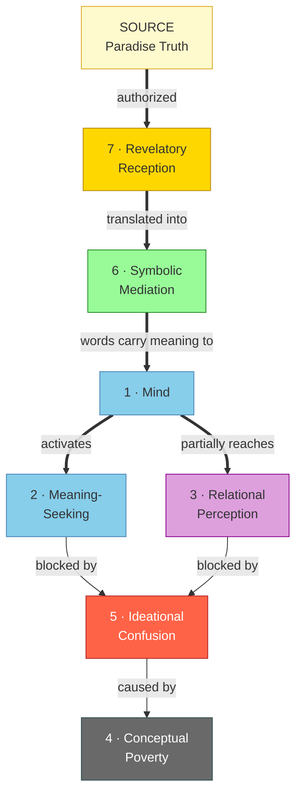
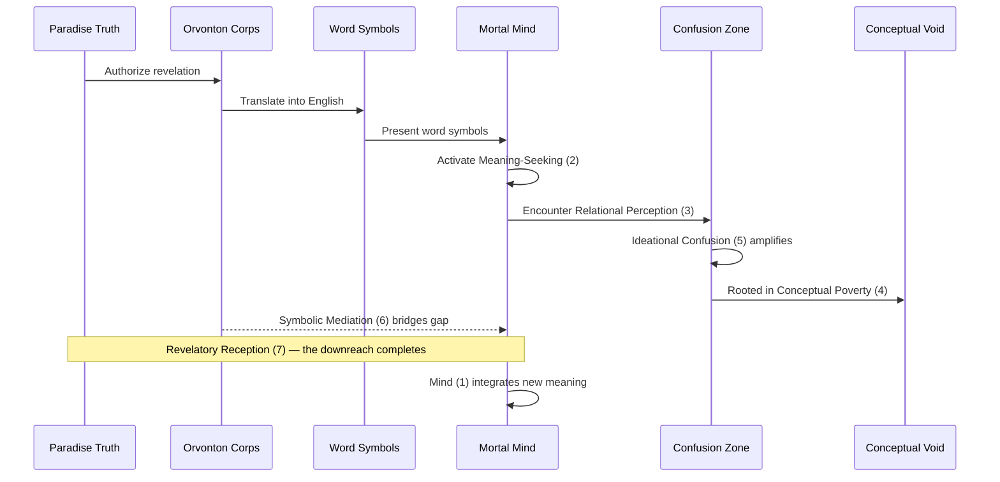
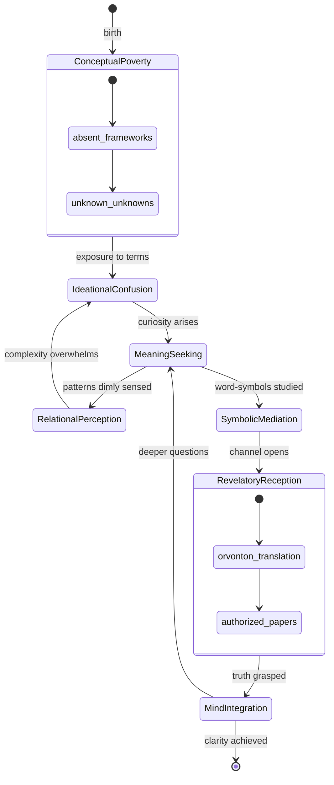
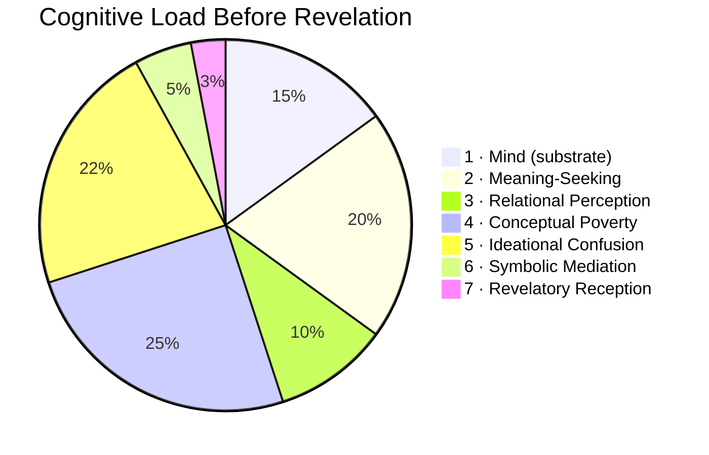
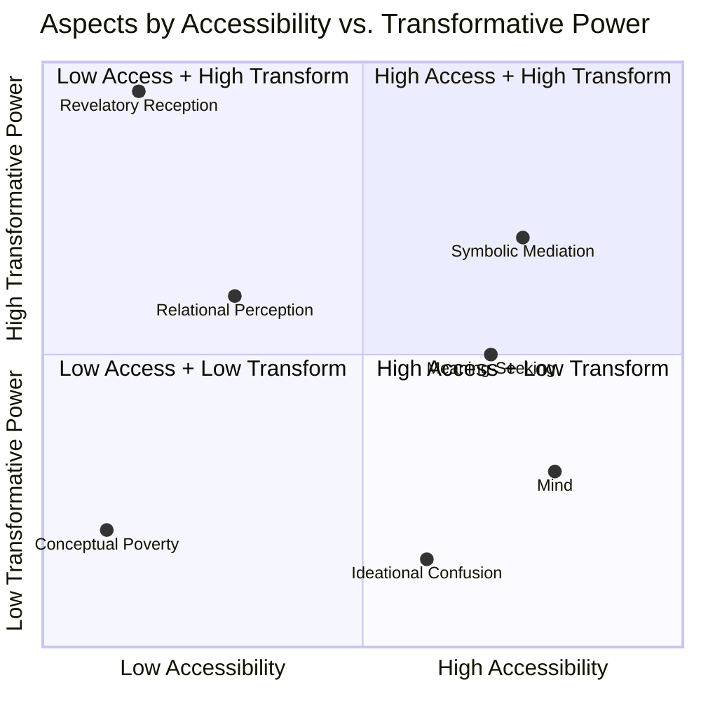
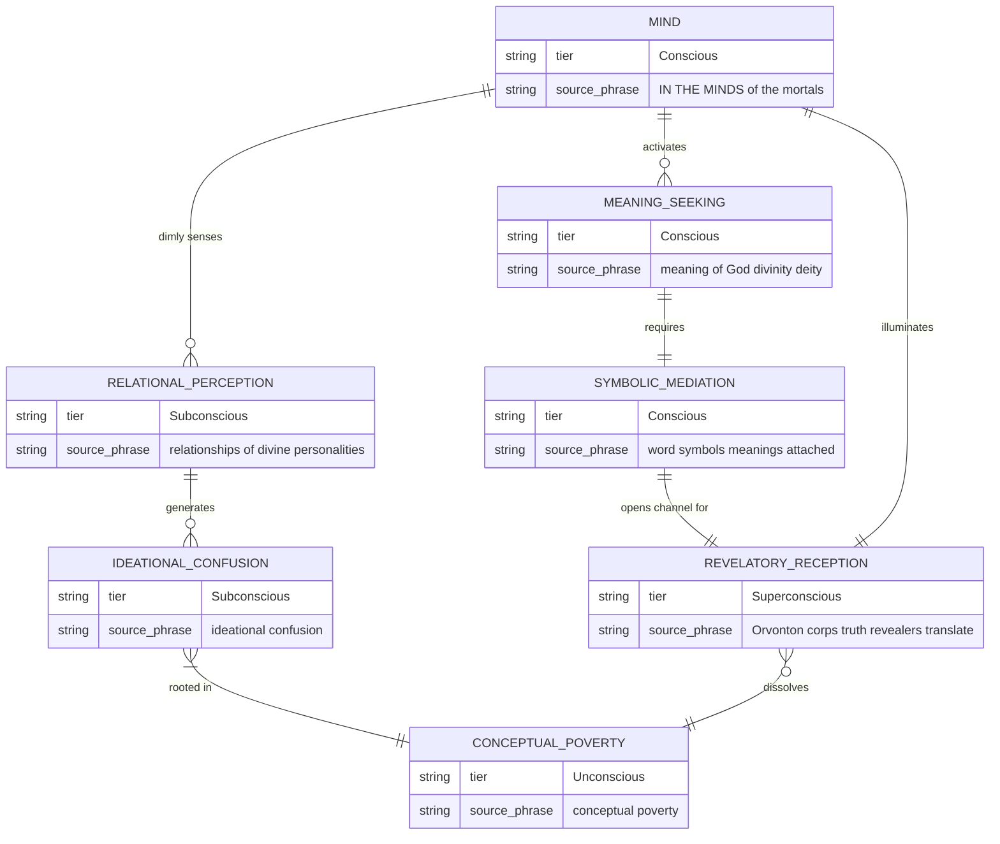
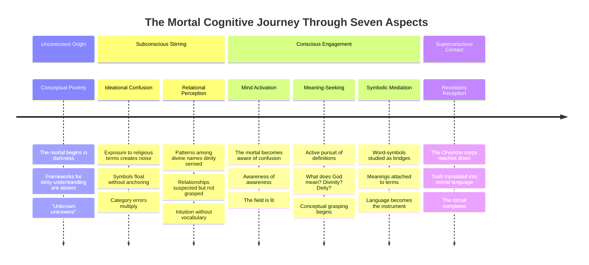

# Mermaid Diagrams — Seven Aspects of Human Perception

Renderable in GitHub, Obsidian, or any Mermaid-compatible viewer.

---

## 1. Consciousness Tier Hierarchy (Top-Down)

---

## 2. Radial / Sunburst View

---

## 3. Flow Diagram — From Poverty to Reception

---

## 4. Sankey-Style: Revelation → Mortal Cognition

---

## 5. Sequence Diagram — The Revelation Transaction

---

## 6. State Diagram — Mortal Cognitive States

---

## 7. Pie Chart — Cognitive Load Distribution (Hypothetical Pre-Revelation Mortal)

---

## 8. Quadrant Chart — Aspect Positioning

---

## 9. Entity-Relationship Diagram — Ontology

---

## 10. Timeline — The Cognitive Journey

---

*All diagrams render natively on GitHub and in Obsidian.*
